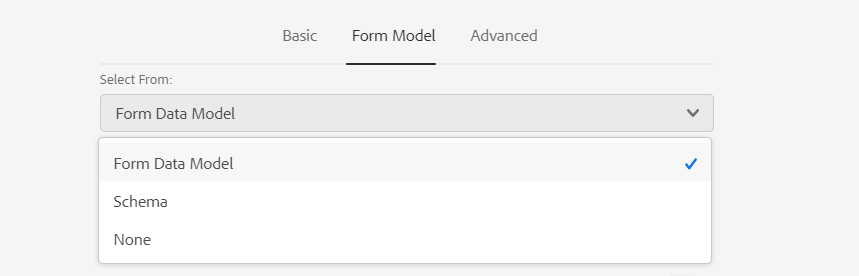

# Create an adaptive form {#creating-an-adaptive-form}

Adaptive forms allow you to create forms that are engaging, responsive, dynamic, and adaptive. AEM Forms provides an intuitive user interface and out-of-the-box components for creating and working with adaptive forms. You can choose to create an adaptive form based on a form model or schema or without a form model. It is important to carefully choose the form model that not only suits your requirements but extends your existing infrastructural investments and assets. You get to choose from the following options to create an adaptive form:

* **Using a form data model**
  [Data integration](data-integration.md) lets you integrate entities and services from disparate data sources in to a form data model that you can use to create adaptive forms. Choose form data model if the adaptive form you are creating involves fetching and write data from and to multiple data source.

  <!--  * **Using an XDP Form Template**
   It is an ideal form model if you have investments in XFA-based or XDP forms. It provides a direct way to convert your XFA-based forms into adaptive forms. Any existing XFA rules are retained in the associated adaptive forms. The resulting adaptive forms support XFA constructs, such as validations, events, properties, and patterns. -->

* **Using an XML Schema Definition (XSD) or a JSON Schema**
   XML and JSON schemas represent the structure in which data is produced or consumed by the back-end system in your organization. You can associate the schema to an adaptive form and use its elements to add dynamic content to the adaptive form. The elements of the schema will be available for use in the Data Model Objects tab of the Content browser when authoring adaptive forms.

* **Using none or without a form model**
   Adaptive forms created with this option don’t use any form model. The data XML generated from such forms has flat structure with fields and corresponding values.

## Pre-requisites

You require the following to create an adaptive form:

* An adaptive form template. A template provides a basic structure and defines appearance (layouts and styles) of an adaptive form. It has pre-formatted components containing certain properties and content structure You can [create a new template](template-editor.md), import an existing template, or download and import some [sample templates](https://documentcloud.adobe.com/link/track?uri=urn:aaid:scds:US:3f89abe1-0ece-492a-b5af-57c73badad52).
* An adaptive form theme. A theme contains styling details for the components and panels. Styles include properties such as background colors, state colors, transparency, alignment, and size. When you apply a theme the specified style reflects on the corresponding components. You can [create a new theme](themes.md), [import an existing theme](import-export-forms-templates.md#uploading-a-theme), or download and import some [sample themes](https://documentcloud.adobe.com/link/track?uri=urn:aaid:scds:US:2779f80e-16ba-4cd1-a96f-8e2b53f3be25).  
* A user with [permissions to create an adaptive form](forms-groups-privileges-tasks.md).

## Create an adaptive form {#strong-create-an-adaptive-form-strong}

Follow these steps to create an adaptive form.

1. Access [!DNL Experience Manager Forms] Author instance. It can be a Cloud instance or a local development instance.

1. Enter your credentials on the Experience Manager login page.

   After you are logged in, in the upper-left corner, tap **[!UICONTROL Adobe Experience Manager]** &gt; **[!UICONTROL Forms]** &gt; **[!UICONTROL Forms & Documents]**.

1. Tap **[!UICONTROL Create]** and select **[!UICONTROL Adaptive Form]**. Select a template and tap **[!UICONTROL Next]**.
1. An option to **Add Properties** appears. Specify the values for following property fields. The Title and Name fields are mandatory:

    * **[!UICONTROL Title:]** Specifies the display name of the form. The title helps you identify the form in the [!DNL Experience Manager Forms] user interface.
    * **[!UICONTROL Name:]** Specifies the name of the form. A node with the specified name is created in the repository. As you start typing a title, value for the name field is automatically generated. You can change the suggested value. The name field can include only alphanumeric characters, hyphens, and underscores. All the invalid inputs are replaced with a hyphen.
    * **[!UICONTROL Description:]** Specifies the detailed information about the form.
    * **[!UICONTROL Tags:]** Specifies tags to uniquely identify the adaptive form. Tags help in searching the form. To create tags, type new tag names in the **[!UICONTROL Tags]** box.

1. You can create an adaptive form based on one of following form models:

    * [Form data model](#fdm)
    <!--* [XFA form template](#create-an-adaptive-form-based-on-an-xfa-form-template)-->
    * [XML or JSON schema](#create-an-adaptive-form-based-on-xml-or-json-schema)
    * None or without any form model

   You can configure these from the **[!UICONTROL Form Model]** tab on the **[!UICONTROL Add Properties]** page. By default, the form model selected is **[!UICONTROL None]**.

1. Tap **[!UICONTROL Create]**. An adaptive form is created and a dialog to open the form for editing appears.

1. Tap **[!UICONTROL Open]** to open the newly created form in a new tab. The form opens for editing and displays the contents available in the template. It also displays the sidebar to customize the newly created form according to the needs.

   Based on the type of adaptive form, the form elements present in the associated <!--XFA form template, -->XML schema or JSON schema are displayed in the **[!UICONTROL Data Model Objects]** tab of the **[!UICONTROL Content Browser]** in the sidebar. You can also drag-drop these elements to build your adaptive form.

## Create an adaptive form based on a form data model {#fdm}

[[!DNL Experience Manager Forms] data integration](data-integration.md) lets you integrate multiple data sources and bring their entities and services together to create a form data model. It is an extension of JSON schema. You can use a form data model to create an adaptive form. The entities or data model objects configured in a form data model are available as data model objects for form authoring. They are bound to respective data sources and used to prefill a form and write submitted data back to the respective data sources. You can also call services configured in a form data model using adaptive form rules.

To use a form data model for creating an adaptive form:

1. In Form Model tab on Add Properties screen, select **[!UICONTROL Form Data Model]** in the **[!UICONTROL Select From]** drop-down list.

   

1. Tap to expand **[!UICONTROL Select Form Data Model]**. All available form data models are listed.Select a from data model.

>[!NOTE]
>
>You can also change the form data model for an adaptive form. For detailed steps, see [Edit Form Model properties of an adaptive form](#edit-form-model).

## Create an adaptive form based on XML or JSON schema {#create-an-adaptive-form-based-on-xml-or-json-schema}

XML and JSON schemas represent the structure in which data is produced or consumed by the back-end system in your organization. You can associate a schema to an adaptive form and use its elements to add dynamic content to the adaptive form. The elements of the schema are available in the Data Model Object tab of the content browser for authoring adaptive forms. You can drag-drop the schema elements to build the form.

See the following documents to understand how to design XML or JSON schema for authoring adaptive forms.

* [Creating adaptive forms using XML schema](adaptive-form-xml-schema-form-model.md)
* [Creating adaptive forms using JSON schema](adaptive-form-json-schema-form-model.md)

Do the following to use XML or JSON schema as form model for an adaptive form:

1. On the **[!UICONTROL Add Properties]** step of adaptive form creation page, tap on the **[!UICONTROL Form Model]** tab.
1. In the Form Model tab, select **[!UICONTROL Schema]** from the **[!UICONTROL Select From]** drop-down field.

1. Tap **[!UICONTROL Select Schema]** and do one of the following:

    * **[!UICONTROL Upload from disk]** - Select this option and tap Upload Schema Definition to browse and upload an XML schema or JSON schema from your file system. The uploaded schema file resides with the form and is not accessible to other adaptive forms.
    * **[!UICONTROL Search in repository]** - Select this option to select from the list of schema definition files available in the repository. Select the XML or JSON schema file as form model. The selected schema is associated with the form by reference and is accessible for use in other adaptive forms.

    Ensure that the JSON schema filename ends with **.schema.json**. For example: mySchema.schema.json

   
**Figure:** *Selecting XML or JSON schema*

1. (For XML schema only) After you select or upload an XML Schema, specify a root element of the selected XSD file to map with the adaptive form.

   
**Figure:** *Selecting XSD root element*

>[!NOTE]
>
>You can also change the schema for an adaptive form. For detailed steps, see [Edit Form Model properties of an adaptive form](#edit-form-model).

## Edit Form Model properties of an adaptive form {#edit-form-model}

Adaptive forms are created without a form model (using the None option for form model) or using a form model such as a form template, XML schema or JSON schema, or form data model. You can change the form model for an adaptive form from None to another form model. For adaptive form based on a form model, you can choose another form template, XML schema, JSON schema, or form data model for the same form model. However, you cannot change from one form model to another.

1. Select the adaptive form and tap the **Properties** icon.
1. Open the **[!UICONTROL Form Model]** tab and do one the following.

    * If the adaptive form is without a form model, you can choose another form model and accordingly select a form template, XML or JSON schema, or form data model.
    * If the adaptive form is based on a form model, you can choose another form template, XML or JSON schema, or form data model for the same form model.

1. Tap **[!UICONTROL Save]** to save the properties.
