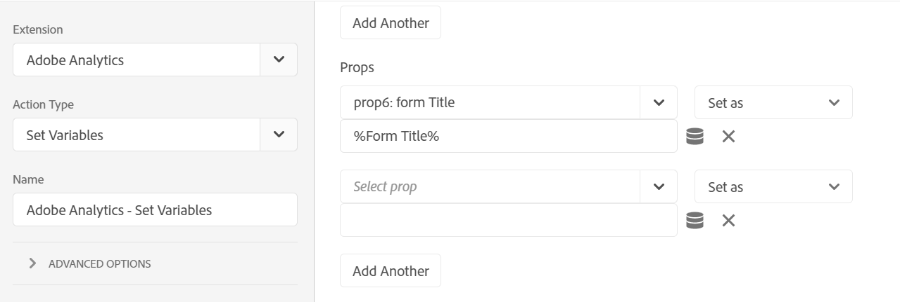
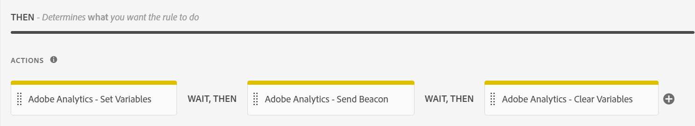

# Integrate with Adobe Analytics {#integrate-aem-forms-with-adobe-analytics}

## Introduction {#introduction}

AEM Forms integrates with Adobe Analytics that allows you to capture and track performance metrics for your published forms and documents. The objective behind analyzing these metrics is to make informed decisions based on data about the changes required to make forms or documents more usable.

You can use Adobe Analytics to discover interaction patterns and problems users face while using adaptive forms, HTML5 forms and interactive communication. Out of the box, Adobe analytics tracks and stores information about the following events:

* **Renditions**: Number of times a form is opened.

* **Submissions**: Number of times a form is submitted.

* **Abandon**: Number of times the users leave without completing the form.

* **Error**: Number of errors encountered on the panel and on the fields of the panel.

* **Help**: Number of times a user opens help of a panel and the fields of the panel.

* **Field Visit**: Number of times a user visits a field in the form.

* **Save**: Number of times users save a form to the Forms Portal.

In addition to these out of the box events, you can define custom events in adaptive forms using rule editor and map those events to **Capture Custom Event** in Adobe Analytics. 

### Configure Adobe Analytics {#Configure-adobe-analytics}

Before configuring Adobe Analytics, you must:

* Have an Adobe ID to log on to [Adobe Experience Cloud](https://experience.adobe.com/#/home).
* Select an appropriate organization to configure analytics on Adobe Experience Cloud.
* Create a [report suite](https://experienceleague.adobe.com/docs/analytics/admin/manage-report-suites/new-report-suite/t-create-a-report-suite.html?lang=en).

#### Install AEM Forms and Adobe Analytics extensions {#install-extensions}

Perform the following steps to configure AEM Forms and Adobe Analytics extensions:

1. Log on to Adobe Experience Cloud and select an appropriate organization.

1. Tap **[!UICONTROL Launch/Data Collection]** and tap **[!UICONTROL Go to Launch/Data Collection]**.

1. Tap **[!UICONTROL New property]** and specify a name for the configuration.

1. Specify a domain name and tap **[!UICONTROL Save]** to save the configuration.

1. Tap the configuration name available in the list of Tag Properties.

1. In the **[!UICONTROL Authoring]** section, tap **[!UICONTROL Extensions]**.

1. Tap **[!UICONTROL Catalog]** and tap **[!UICONTROL Install]** for the **[!UICONTROL Adobe Experience Manager Forms]** extension. **[!UICONTROL Adobe Experience Manager Forms]** displays in the list of installed extensions available in the **Installed** tab.

1. Tap **[!UICONTROL Install]** for the **[!UICONTROL Adobe Analytics]** extension.
1. Select the report suite name in the **[!UICONTROL Development Report Suites]**, **[!UICONTROL Staging Report Suites]**, and **[!UICONTROL Product Report Suites]** drop-down lists and tap **[!UICONTROL Save]** to save the extension.

#### Configure data elements {#configure-data-elements}

After installing the **[!UICONTROL Adobe Experience Manager Forms]** extension, you can create the following data elements:

* FieldName
* FieldTitle
* FormInstance
* FormName
* FormTitle
* PageName
* PageURL
* PanelTitle
* TimeSpent

You can select any of these configured data elements in a rule created for an event. When an event occurs on an adpative form, AEM Forms sends these data elements to Adobe Analytics. 

Perform the following steps to configure data elements:

1. In the **[!UICONTROL Authoring]** section, tap **[!UICONTROL Data Elements]**.

1. Tap **[!UICONTROL Create New Data Element]**.

1. Specify a name for the Data Element. For example, Form Title for FormTitle data element type.

1. Specify **[!UICONTROL Adobe Experience Manager Forms]** as the Extension name.

1. Select the **[!UICONTROL Data Element Type]**.

1. Tap **[!UICONTROL Save]** to save the data element.

#### Configure rules {#configure-rules}

Perform the following steps to create rules based on the **[!UICONTROL Adobe Experience Manager Forms]** extension:

1. In the **[!UICONTROL Authoring]** section, tap **[!UICONTROL Rules]**.

1. Tap **[!UICONTROL Create New Rule]**.

1.  Specify a name for the Rule. For example, Form Submit to record form submissions.

1. In the **[!UICONTROL Events]** section, tap **[!UICONTROL Add]**.

1. Specify **[!UICONTROL Adobe Experience Manager Forms]** as the Extension name.

1. Select the event type. The vaue for the **[!UICONTROL Name]** field populates automatically based on the selected event type.

1. Tap **[!UICONTROL Keep Changes]** to save the event.

1. In the **[!UICONTROL Actions]** section, tap **[!UICONTROL Add]**.

1. Specify **[!UICONTROL Adobe Analytics]** as the Extension name.

1. Select **[!UICONTROL Set Variables]** as the Action Type.The options available in the drop-down list include:

   * **[!UICONTROL Set Variables]**: Use this action type to define the event type for which the selected data elements are sent from AEM Forms to Adobe Analytics.

   * **[!UICONTROL Send Beacon]**: Use this action type to send data from AEM Forms to Adobe Analytics.

   * **[!UICONTROL Clear Variables]**: Use this action type to clear the data trail so that the event registers only once in Adobe Anaytics.

     The recommended approach is to use the **[!UICONTROL Set Variables]** action type to configure the event and data elements, then use **[!UICONTROL Send Beacon]** to send data, and then use **[!UICONTROL Clear Variables]** to clear the data trail.

1. In the **[!UICONTROL Props]** section, map the report suite options available in the drop-down list with the data elements defined using [Configure data elements](#configure-data-elements).

   For example, to send **Form Title** data element from AEM Forms to Adobe Analytics when you submit a form:
   1. In the **[!UICONTROL Props]** section, select a prop for Form Title available in the report suite and then tap  to map it to Form Title created in [Configure data elements](#configure-data-elements).

      

   1. Tap **[!UICONTROL Add Another]** to add more data elemets to the list.

1. In the **[!UICONTROL Events]** section, select an event from the options available in the report suite and tap **[!UICONTROL Keep Changes]**.

1. In the **[!UICONTROL Actions]** section, tap + and specify **[!UICONTROL Adobe Analytics]** as the Extension name.

1. Select **[!UICONTROL Send Beacon]** as the Action Type. In the right pane, Select **[!UICONTROL s.t()]** to send data to Adobe Analytics and treat it as a page view or **[!UICONTROL s.tl()]** to send data to Adobe Analytics and do not treat it as a page view. Tap **[!UICONTROL Keep Changes]**.

1. In the **[!UICONTROL Actions]** section, tap + and specify **[!UICONTROL Adobe Analytics]** as the Extension name.

1. Select **[!UICONTROL Clear Variables]** as the Action Type. Tap **[!UICONTROL Keep Changes]**. After performing these steps, the **[!UICONTROL Actions]** section displays as:
   

    Customize the **[!UICONTROL Actions]** section according to your requirements. For example, you can define two **Send Beacon** steps in an Actions flow to send data to Adobe Analytics and treat it as a page view in one step and send data to Adobe Analytics and do not treat it as a page view in the second step.

   

   You can create rules for all event types, such as Abandon, Error, Field Visit, Help, Render, Save, and Submit.

#### Publish flow {#publish-flow}

After creating the data elements and using them in rules, you must publish the configuration to collect form data in Adobe Analytics.

Perform the following steps to publish the configuration:

1. In the **[!UICONTROL Publishing]** section, tap **[!UICONTROL Publishing Flow]**.

1. Tap **[!UICONTROL Add Library]** and specify a name and select the environment for the library.

1. Tap **[!UICONTROL Add All Changed Resources]** and then tap **[!UICONTROL Save & Build to Development]**.

1. In the **[!UICONTROL Development]** section, tap  and then tap **[!UICONTROL Approve & Publish to Production]**.

1. Confirm the changes and the publishing flow soon displays in the **[!UICONTROL Published]** section.

### Configure AEM Forms {#configure-aem-forms}

#### Create Adobe Launch Configuration {#create-adobe-launch-configuration}

Procedure to create an Adobe Launch configuration using AEM Forms.

#### Enable Adobe Analytics for an adaptive form {#enable-analytics-adaptive-form}

Integrate the Adobe Launch configuration in an adaptive form.

#### Create rules to capture custom events {#capture-custom-events}

Create rules on specific fields of an adaptive form using rule editor to send Analytics data from an adaptive form to Adobe Analytics.

### Configure and view reports in Adobe Analytics {#view-reports-adobe-analytics}

How to configure and view reports in Adobe Analytics based on data received from an adaptive form.